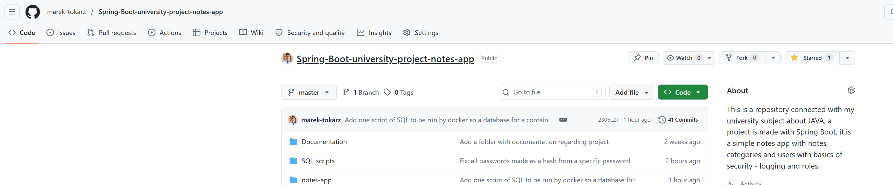
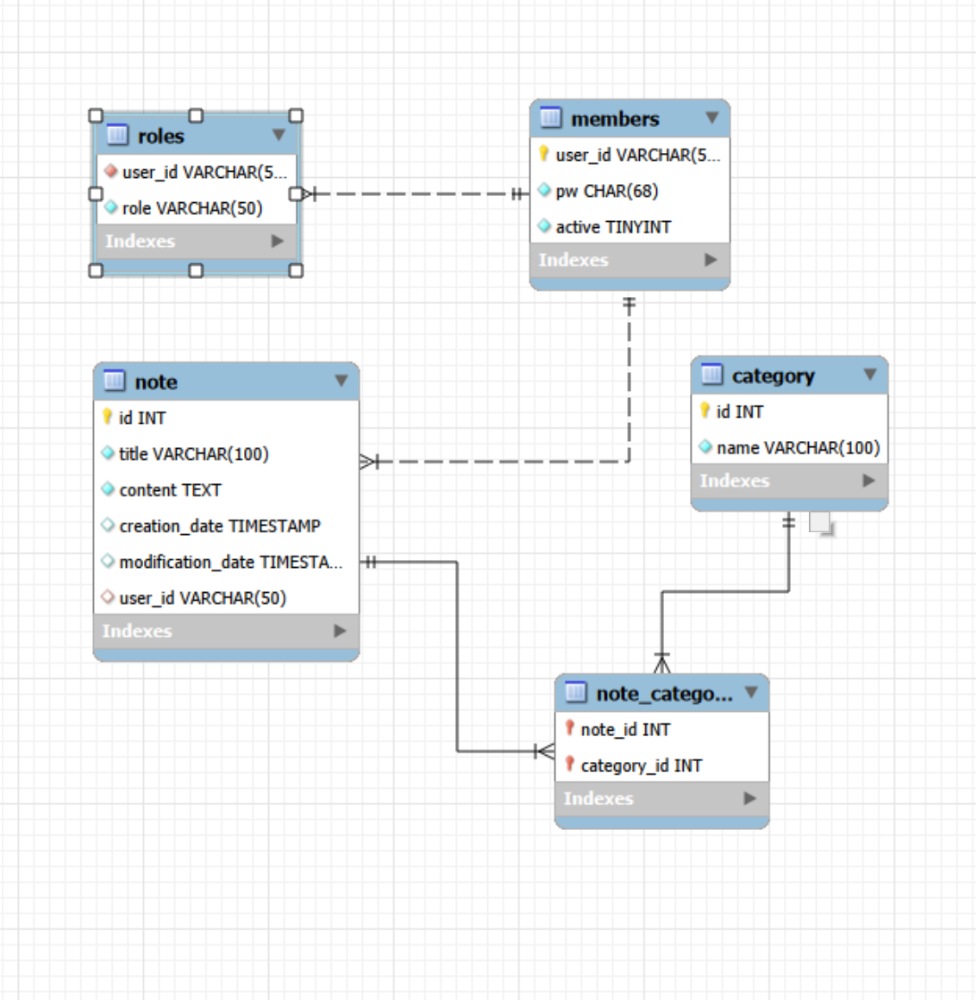
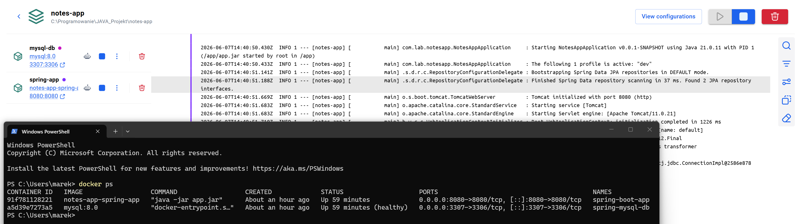
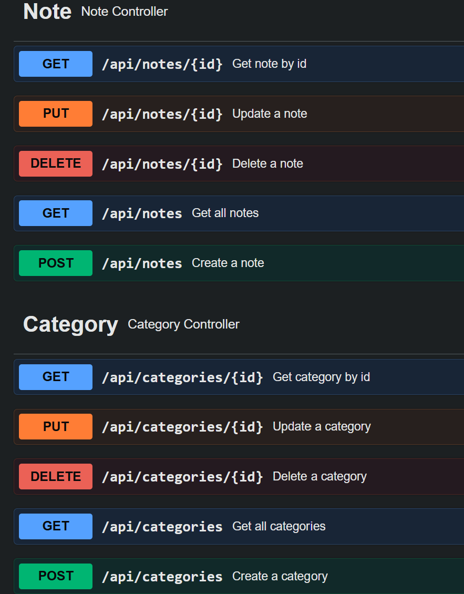
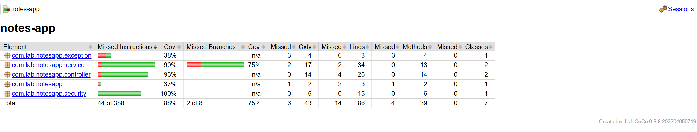

# JAVA

## Laboratoria

### Dokumentacja do projektu

### Aplikacja do tworzenia i kategoryzowania notatek

Marek Tokarz, nr indeksu: 147103

#### Repozytorium:
https://github.com/marek-tokarz/Spring-Boot-university-project-notes-app

#### Diagram ERD

#### 

#### Docker

#### Swagger

#### JaCoCo - pokrycie testami

